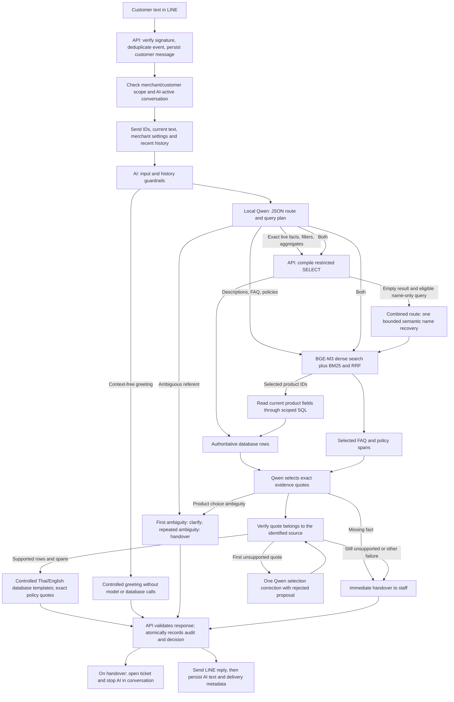
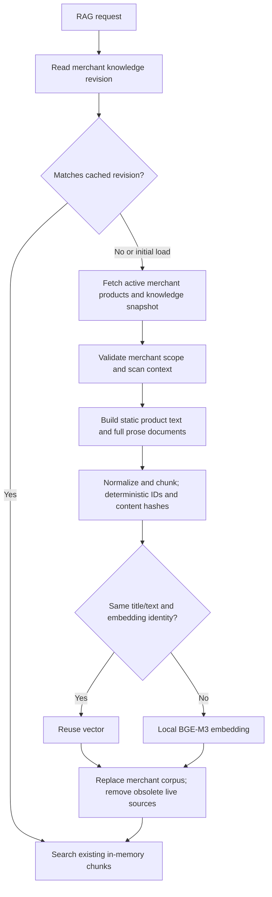

# Chatto Phase 2 question-answering architecture

This describes the implemented working tree, including the backend retrieval
path and the local Qwen/Ollama integration. It separates current behavior from
production improvements and experimental hypotheses. The system answers
customer questions using merchant data and reads product availability; it does not create orders,
take payments, reserve inventory, execute refunds, or modify stock.

## What changed from the selected GitHub branch

The development base is `feature/mcp-confidence-guardrail` at commit
`7d7fe3960734134b800922204038addd0569b05e`. This document describes the local
changes on top of that base. The previous development work is backed up;
these changes have not been pushed to GitHub.

| Question | Branch base at `7d7fe396` | Current local implementation |
| --- | --- | --- |
| What travels from API to AI service each chat? | Merchant settings, products, knowledge documents, stored vectors and recent history were exported together. | IDs, customer text, settings and recent history. A RAG request checks a small revision; a full active corpus is fetched on initial load or revision change. |
| What travels to the answer LLM? | Selected retrieval chunks, history and settings; the full internal API payload was not automatically the answer prompt. | Planner receives question/history/settings. Selector receives bounded retrieved prose and current SQL rows. Embedding vectors are used for ranking, not sent as factual text to Qwen. |
| Does stock changing regenerate every embedding immediately? | No database-write hook regenerated the corpus. An eligible retrieval chat rebuilt product text, which included price and available quantity. A changed chunk hash prevented reuse, so enrichment regenerated affected chunks when embeddings were configured. Unchanged compatible chunks were reused. | Stock/price changes do not change static index text or its database revision. Answers read those fields live through scoped SQL. A changed description, variant identity or policy refreshes the index and reuses unaffected text vectors. |
| How are live numeric questions answered? | Product price/availability were part of product text and selected retrieved evidence. | Exact filters, aggregates and current values use constrained text-to-SQL; RAG product hits also use a fixed product-ID lookup. |
| What determines retrieval order? | The branch's semantic/lexical retrieval and evidence heuristic. | BGE-M3 dense cosine plus Thai/English BM25, rank fusion and optional deterministic reranking. |
| What does confidence mean? | An uncalibrated intent/retrieval heuristic and threshold. | A binary output acceptance gate for bound evidence or an approved greeting. It is still not a calibrated probability of correctness. |
| Where are vectors kept? | Database vector export/sync endpoints plus in-request processing. | The new backend QA path uses bounded per-process RAM caches. Compatibility vector endpoints remain, but the QA cache is not a persistent ANN index. |

This separates two load questions. The old internal API transfer could include
the entire merchant corpus on each turn, while the generation LLM already saw
selected chunks. The new path reduces that repeated transfer and keeps changing
stock/price values outside the embedding workload. It still downloads a full
active snapshot on a static revision change, scans the small RAM corpus for
retrieval, and may re-embed after restart or eviction. The experiment compares
new SQL, RAG-with-live-lookups and combined routes; it does not establish a
measured end-to-end speedup over the original branch unless that branch is also
run under identical conditions.

## End-to-end request path



`apps/api` owns LINE ingress, PostgreSQL access, tenant scope, conversation
state and delivery. `apps/ai-service` owns planning, retrieval, evidence
selection and rendering. Qwen proposes SQL and source selections; application
code controls what can run and what text can leave the service.

`AiIntegrationService.withMerchantContext` sends merchant settings and the
previous 12 messages, excluding the current one. It sets
`ai_options.backend_retrieval=true` by default. It does not attach all products,
knowledge documents or vectors to every chat. The explicit
`AI_CONTEXT_MODE=inline` option retains the previous full-context compatibility
path. `ChatPipeline` enters `QaEngine` for backend retrieval with the Ollama
provider; the earlier MCP confidence/guardrail pipeline remains for inline or
other-provider compatibility. These paths have different confidence semantics.

The QA planner receives the current question and up to eight recent messages,
each clipped to 1,500 characters. It chooses SQL, RAG, both, or clarification.
History helps resolve follow-up references, but the model can still resolve a
pronoun incorrectly. The selection model receives at most ten evidence items,
each clipped to 2,400 characters. These are character bounds, not a tokenizer
budget. Ollama currently uses an 8,192-token context and a 700-token output
limit; overlong prompts and missing conditions remain evaluation concerns.
Simple greetings use a fixed Thai/English reply without loading the model or
retrieving knowledge. Merchant settings accompany the planner, but free-form
rules remain untrusted context rather than authority to expand database access.

## Module responsibilities

The planner and evidence selector use Ollama's JSON-schema constrained output
(see [Ollama structured outputs](https://docs.ollama.com/capabilities/structured-outputs)).
This constrains response structure, not factual correctness. The SQL-only
experiment uses its own routing instructions so normal RAG routing does not
conflict with that baseline. Individual catalogue queries request product and
variant identity, colour, size, descriptions and live fields together; aggregate
queries preserve their own projection semantics. A compiler-rejected SQL
proposal gets at most one model correction through the same scoped compiler.
Authentication and transport failures do not trigger a correction. Planning
attempts and query outcomes are recorded, and correction time is included in
planning time without being counted again as SQL execution time.

| Module | Responsibility |
| --- | --- |
| `line-webhooks` | Signature verification, event deduplication, message persistence and LINE reply delivery. |
| `ai-integration` | Build lean request, check AI ownership, validate response and persist safety/handover decisions. |
| `internal-ai/readonly-query.compiler` | Parse model SQL into an AST and compile only the allowed SELECT dialect. |
| `internal-ai/readonly-query.service` | Add merchant-scoped relations and execute bounded read-only transactions. |
| `internal-ai/internal-ai.service` | Knowledge revision, changed-corpus snapshots, settings and bounded history exports. |
| `qa/backend` | Token-protected HTTP access to revision, snapshot and read-only query endpoints. |
| `qa/engine` | Plan route, orchestrate SQL/retrieval, prepare the index, select evidence and abstain safely. |
| `qa/fallback` | Check a parsed empty-result SQL plan before permitting bounded semantic name recovery. |
| `qa/grounding` | Render field/value rows and bind exact contiguous source quotes. |
| `qa/customer-renderer` | Present verified database values using controlled Thai/English wording; preserve policy quotes exactly. |
| `embeddings` | Local/explicit remote embedding requests, vector normalization, content/model reuse and bounded request cache. |
| `retrieval` and `rag` | Thai/English BM25, dense cosine, RRF fusion and optional bounded deterministic reranking. |
| `llm/ollama-client` | JSON calls, fixed model controls and inference/token timing observations. |
| `mcp` | Authenticated MCP SDK transport, validated resources/tools and compatibility adapters. |

## Live SQL facts and prose retrieval

SQL is useful for current price, quantity, exact SKU, numeric filters, totals,
counts and comparisons. Those are structured database facts. Semantic
retrieval is useful for descriptions and differently worded FAQ or policy
questions, including cross-language matches. A combined question can need
both: “Which blue bags are below 500 THB, and can I return them?” requires
current variant rows plus the relevant return policy and conditions.

The model sees two logical relations only:

- `catalog`: active merchant products/variants with identifiers, name,
  description, category, brand, SKU, variant/color/size, price, currency and
  available quantity.
- `knowledge`: active merchant document IDs, types, titles and content.

The API defines these as server-owned CTEs with `merchant_id=$1`; the model
cannot choose another merchant or read customers, credentials, users, messages
or arbitrary physical tables. Catalog has one row per active variant and a
fallback row for an active product with no active variant. A count
of products must use distinct product IDs when products have several variants;
the model can produce valid SQL with incorrect business semantics, so this
requires gold-labelled tests. Unknown stock remains `NULL`/`unknown`, while
known zero remains zero. The compatibility product export and AI request schema
also preserve unknown `stock_qty` and `available_qty` as `null`; they do not
turn an absent stock row into zero.

`compileReadonlyQuery` parses one SELECT, validates relations/columns/operators
and reconstructs SQL. It never executes the original model string. Writes,
multiple statements, joins, model-defined CTEs, subqueries, schema-qualified
relations, arbitrary functions and fabricated literal projections are outside
the supported AST dialect. Allowed aggregates are COUNT, SUM, MIN, MAX and AVG;
allowed comparisons include ILIKE, IN and BETWEEN. WHERE literal values become
parameters after the server-selected merchant parameter. Comments from source
SQL are not forwarded to the reconstructed query.
Plain field projections retain their original field names; aggregate aliases
cannot reuse catalog or knowledge field names. This blocks `price AS
available_qty` and `SUM(price) AS available_qty` from changing a price into a
quantity label before rendering.
All returned aggregate labels are also generated from the validated operation
and source column, rather than the model's alias: `SUM(price) AS total_units`
returns `sum_price`; `COUNT(*)` returns `count_catalog_rows` or
`count_knowledge_rows`; `COUNT(DISTINCT product_id)` returns
`count_distinct_product_id`. A model alias can be resolved inside ORDER BY or
HAVING, but cannot become the returned factual label. Duplicate canonical
projections are rejected.

The customer renderer calls a catalogue row count "catalogue rows" because a
fallback row does not establish an active variant. Distinct product and variant
ID counts retain their respective meaning. Availability aggregates retain unit
labels. Price aggregates only display a currency from a selected authoritative
currency field; otherwise the answer explicitly says the currency is not
specified. Summing or comparing prices across different currencies is still a
business-semantic error unless the query groups/filters currency appropriately.

Limits include an 8,000-character input query, bounded AST depth/complexity,
limited projections and IN lists, at most 50 returned rows with an overflow
sentinel, a 2-second database statement timeout and a read-only transaction.
The engine refuses a result reported as truncated. A planner-requested LIMIT
20 can still omit relevant rows without triggering the 50-row overflow flag;
ask aggregates rather than treating a small displayed sample as an exhaustive
catalog. This is a constrained text-to-SQL interface, not arbitrary model SQL
execution.

In the combined route, a successful query with zero rows can trigger one
semantic name-recovery step. `qa/fallback.permitsNameSearchFallback` inspects the
SQL AST and only accepts a single plain `catalog` SELECT with field-reference
projections and a WHERE tree composed entirely of `name`/`sku` LIKE or ILIKE
string comparisons, joined by AND/OR. Grouping, HAVING, aggregates, DISTINCT,
joins, other relations, ordering, offsets and other predicate fields exclude
this fallback. It does not run for compiler/authentication/transport errors,
truncated results, SQL-only experiments or disabled product QA.

An eligible miss searches the bounded semantic corpus and hydrates trusted
product IDs through the fixed scoped catalog lookup, then uses the same evidence
selector and binding rules. It is intended for abbreviated or differently
worded product names. It cannot widen a numeric, colour, size or availability
predicate: any such predicate makes the plan ineligible. It also cannot infer a
whole-catalog aggregate from retrieved candidates. Recovery is recorded in the
answer's `fallback` field and its work contributes to retrieval/database timing.
Semantic candidates can still refer to the wrong product; the eligibility
check is a structural restriction, not proof that an empty name match has been
resolved correctly.

## Index refresh and embedding changes



Revision checks occur on each retrieval preparation; a pure SQL answer does
not need a vector index. The static-knowledge revision migration adds a
merchant-scoped `BIGINT` sequence maintained by PostgreSQL triggers. The version
endpoint reads merchant status and this revision rather than scanning corpus
counts or maximum timestamps. Product/variant insertions, deletions and changes
to indexed text, identifiers or active status increment the revision. Knowledge
document type/title/content/status changes do the same. Moving a source between
merchants invalidates both merchant revisions. A no-op assignment does not bump
the revision. Apply `20261003133000_static_knowledge_revision` before running this
version endpoint; generating Prisma Client alone does not install its triggers.

Price, currency, stock, reservation, low-stock threshold and timestamp-only
changes do not increment this static revision. These fields are read live when
needed. Source changes and revision increments occur in the same database
transaction. Version and snapshot are still separate requests: the current
engine does not recheck the revision after its snapshot read, so a concurrent
change can require another request to refresh. This is a cache invalidation
sequence, not an event outbox or a transactional multi-source snapshot.

On a changed revision, the service fetches a full active merchant snapshot,
rebuilds chunks and replaces the live corpus. Product text contains product
descriptions, category, brand, variant names, colors, sizes and SKUs. Generated
price, available quantity and reservation fields are excluded. A stock/price
edit leaves both the static revision and unchanged static text vectors reusable.
The snapshot export still includes product fields needed by the compatibility
contract, including dynamic values; the new builder omits them from embedding
text. Final product answers read current values through SQL;
the vector snapshot does not establish the stock or price.
If a merchant edits a prose policy to mention a new price or stock number, that
document's content did change and is indexed again. Static means fields chosen
for the search index, not a claim that every document describes immutable facts.

Changed descriptions or policies change chunk text; changed embedding
provider/model/dimensions invalidate reuse. Embedding requests are normalized,
deduplicated in flight and cached in a bounded 256-entry memory cache.
Concurrency is bounded to three document requests. Local Ollama `bge-m3`
uses 1,024 dimensions by default; Gemini is an explicit alternative, and
`none` supports offline lexical tests. Disabling generation's remote provider
does not automatically change the embedding provider: configure both.

`QaEngine` keeps at most 32 merchant corpora and coalesces simultaneous refresh
requests. BM25 statistics use a separate cache bounded to 16 corpus versions.
This QA path is currently in memory: restart/eviction can require reloading
and re-embedding, and each process has its own cache. It does not persist a
production vector index. The compatibility database vector endpoints remain
available but do not make the new QA cache a pgvector/ANN implementation.
Partial embedding failures are cached as degraded preparation and retried after
a 30-second backoff; they do not prove that dense retrieval is ready. Cache
reuse checks both the database revision and embedding identity.

## Retrieval and evidence selection

BM25 uses ICU word segmentation for Thai and English and preserves compound
SKU tokens. It applies term-frequency saturation, inverse document frequency
and document-length normalization. Dense retrieval uses normalized BGE-M3
vectors and cosine similarity. Hybrid retrieval fuses ranks with RRF (k=60),
avoiding the addition of unbounded BM25 scores to cosine scores.

The available retrieval modes are dense, BM25, hybrid and hybrid with reranking.
Each ranking uses a default candidate bound of 40, configurable up to 200;
the merged candidates are bounded before reranking. The normal QA engine takes
five chunks. The optional reranker combines rank score, query-token coverage
and exact SKU/title matches. It is deterministic and is not a neural
cross-encoder. Add a cross-encoder only if development-set ablations show
better retrieval or task accuracy sufficient to justify its local inference
and latency cost.

Search currently scans RAM vectors and builds/scans lexical corpus statistics.
It is appropriate as a Phase 2 baseline; it is not evidence of production
scale. Merchant scope and active status are applied before scoring. A source
type bonus alone cannot produce a hit. Dense mode without a usable vector
returns no hits; hybrid can use BM25 when the embedding provider is unavailable.

The QA engine does not answer product questions from embedded product text.
When `product_qa` is disabled in merchant settings, SQL/hybrid routes are
blocked and RAG product hits cannot trigger a live product lookup. Non-product
FAQ/policy matches remain eligible, avoiding a product hit blocking an otherwise
valid policy answer.
Retrieved product IDs lead to current structured rows. Non-product chunks
supply prose sources. A SQL row containing knowledge `content` is also treated
as prose evidence, rather than as an indivisible catalogue or aggregate row.
Qwen then proposes at most six `{source_id, quote}`
claims. For prose, `bindClaims` requires each quote to be an exact contiguous
substring of that identified source. For database rows, the model selects the
source ID and the server replaces its proposed quote with that row's complete
canonical field/value rendering. The model cannot rewrite its values or units.
The customer renderer then applies controlled Thai/English templates to the
verified row. It removes technical UUIDs and keeps readable product/variant
details, amounts, currencies and quantities associated with their fields.
Mixed price/stock and material/care requests retain the verified description;
explicit brand/category requests retain those fields. These presentation rules
use simple language patterns, so unfamiliar wording can still miss a requested
field and requires completeness evaluation.
Prose claims remain exact source spans, without an unconstrained generated
paragraph or model-authored translation. This applies to knowledge reached by
SQL as well as retrieval: selecting a domestic shipping condition does not
automatically emit the whole knowledge row and its unrelated missing
international-fee statement.

If the first selection fails exact binding with `UNSUPPORTED_CLAIM`, the engine
permits one selection correction using the same bounded evidence and the
rejected proposal. It does not relax the quote rule or run another database
query. A second unsupported selection hands over. Missing facts, ambiguity,
authentication failures and provider failures do not trigger this correction.
`selectionAttempts` preserves both proposals when a correction occurs and
`rawSelection` preserves the original one. Both calls' latency and reported
tokens are included in the generation totals. The experiment screens raw
quotes from every attempt; a later accepted quote does not erase an earlier
unsupported proposal.

For example, a database source with `price: 390; currency: THB;
available_qty: 9` preserves those values in natural wording, even if the model's
proposed quote says `price: 9` or `currency: USD`. An unknown source ID fails
binding. This is stronger than checking whether the numbers 390 and 9 appear
somewhere in the context, and preserves field/value association.

Exact binding plus controlled row templates prevents model-invented fact values
from being emitted,
but it does not prove that the source is relevant or that the answer is
complete. The model can select the wrong product, omit an exception, quote
too little, or choose a truthful row produced by the wrong SQL filter. A
short source span can also lose important nearby context. Gold answer checks
must evaluate source correctness, required facts, conditions and answer
coverage in addition to quote validity.

## Clarification, handover and confidence

The schema-constrained evidence selector distinguishes
`ambiguity_kind: "product_choice"` from `"missing_fact"` and `"none"`.
A product-choice ambiguity means multiple plausible products/variants remain
and the customer has not identified which one. The first such turn asks for a
name, variant or colour; a repeated ambiguity hands over. A `missing_fact`
decision hands over immediately, including when the question is about an
unavailable specification rather than an unclear product. This decision takes
precedence over the general `ambiguous` flag. `ChatPipeline` currently recognizes the previous
clarification by matching its stored AI text, rather than a dedicated
persistent uncertainty counter. Missing evidence, rejected SQL, unsafe input,
invalid claims, provider failure or truncated results can hand over directly.
Clarification is not an answer with a low-probability invented fact.

There is also a post-render wording gate for selected statements that information
or a requested specification is unavailable/not published/not recorded, with
Thai alternatives. A matching answer is replaced with the controlled handover
message. This is a heuristic safeguard: an unfamiliar way of saying "unknown"
may be missed, and an unrelated absence statement inside a longer truthful
description can cause an unnecessary handover. It neither proves semantic
correctness nor establishes that every known fact in the same source is
unanswerable. Evaluate missing-fact recognition separately from entity
ambiguity and from factual groundedness.

The backend QA path exposes a binary source-span gate through the existing
confidence contract: 1 for an accepted answer and 0 for clarification/handover.
For factual answers, acceptance uses source binding, controlled rendering and
the current ambiguity/missing-information gates;
context-free greetings are separately approved fixed text, labelled
`CONTEXT_FREE_GREETING` with zero factual-evidence signal and zero sources.
This is **not a
probability of correctness**, despite
legacy fields such as `confidence.score` and `level: high`. A value of 1 says
the accepted output passed the current evidence-binding checks; the wrong
source or incomplete answer may still pass. The older inline path retains its
uncalibrated intent/retrieval heuristic. Neither should be reported as
“96%/100% accurate.”

The API validates response identity/shape and atomically locks the scoped
conversation before recording a decision. It audits guardrail outcomes,
deduplicates repeated request decisions and suppresses sends after human
takeover. Handover creates or reuses an open ticket and changes the
conversation to human ownership. A clarification keeps the AI conversation
active. LINE delivery follows that audit/state transition, then the AI text
and delivery outcome are persisted; a database decision and a successful LINE
delivery are separate events.

Input/context guardrails remain rules and regex checks. They reduce common
injection/secret/action patterns but are not a complete injection detector or
semantic fact checker. Local inference and exact binding complement those
checks; they do not remove the need for adversarial and bilingual evaluation.
Guard text is normalized with NFKC, invisible separators are removed and spaces
are collapsed. NFKC decomposes Thai SARA AM (`ำ`) into NIKHAHIT plus SARA AA
(`ํ` + `า`); the guard restores that sequence to `ำ` before matching. This makes
ordinary and decomposed Thai spellings match the same security rules while
retaining compatibility normalization for full-width ASCII. It fixes a specific
normalization failure, rather than establishing complete Thai injection
detection.

## Why SQL plus hybrid RAG is a useful design here

The professor's proposal fits Chatto's data: current variant facts and numeric
operations benefit from structured queries; descriptive/policy wording benefits
from lexical and semantic retrieval. Combining them keeps stock updates out
of the embedding workload and allows questions with both structured and prose
parts. The design is justified by those distinct responsibilities, not by an
assumption that adding more components always improves answers.

Its costs are another planning step, SQL semantic mistakes, database queries,
index refreshes and evidence selection. A fixed typed lookup is simpler than
text-to-SQL for a known SKU/price question. The current RAG path already uses
such a server-generated product-ID lookup after retrieval. Broad filters and
aggregates are the more persuasive use cases for constrained generated SQL.
Evaluate a strong RAG-with-live-lookups baseline against SQL-only and combined
routes using the same model, source records, controls and gold labels.
The [first frozen synthetic comparison](../experiments/qa-results-20261005.md)
favoured the combined route but still found nine failed distinct questions.
Improvements tested on those inspected questions are post-debug validation;
they need a new independent test set before claiming generalization.
The [final validation](../experiments/qa-validation-final-20261005.md) improved
combined to 64/72 task checks and 46/52 answerable exact-fact checks, with four
distinct failures remaining. The gain includes better abstention/safety
decisions; it is larger than the factual-answer gain and is not a human
correctness or hallucination estimate. All retrieval methods tied on the small
positive-source set, so no reranking quality benefit was demonstrated.

Do not fine-tune before development/test error analysis identifies the actual
failure mode. Wrong data/scope, stale index, bad SQL, missed sources, omitted
conditions and poor bilingual rendering require different fixes. A fine-tuned
model cannot repair an incorrect authoritative row or an invalid tenant scope.
Use a frozen test split and include abstentions/errors in accuracy and coverage
denominators. See [the experiment protocol](../experiments/qa-architecture-comparison.md).

## User experience and performance limits

Database price and stock answers use controlled Thai/English wording rather
than exposing `available_qty` or product UUIDs. Explicit foreign currencies are
preserved; missing facts remain unknown and known zero remains zero. Generic
aggregate aliases or untemplated fields can still yield plain field labels.
Policy answers preserve the selected quote's language. The selector receives
the customer's preferred language and is instructed to prefer an equivalent
supplied span in that language, including its conditions. Exact binding does not allow translation
of an English quote into newly generated Thai prose. Curated bilingual policies
and choosing the corresponding source are therefore useful quality improvements.
Measure factual associations, policy exceptions, completeness and readability
after presentation changes. Thai retrieval support alone does not establish
native-quality Thai answers.

Model loading, document preparation and warmed requests are different costs.
A local Qwen smoke test established that the chosen model runs; individual
cold/warm observations do not establish a stable latency claim. Record cold
model load, first index preparation, planner, retrieval, SQL, selector, tokens
and end-to-end latency separately. Cache hits and serial synthetic tests do
not establish concurrent capacity or LINE delivery reliability. The model may
be local while the LINE API remains external.

## Local configuration and verification

Use these defaults from `.env.example` for the backend QA path:

```dotenv
AI_CONTEXT_MODE=backend
AI_LLM_PROVIDER=ollama
OLLAMA_BASE_URL=http://127.0.0.1:11434
OLLAMA_MODEL=qwen3.5:9b
OLLAMA_TIMEOUT_MS=60000
AI_EMBEDDING_PROVIDER=ollama
OLLAMA_EMBEDDING_MODEL=bge-m3
OLLAMA_EMBEDDING_DIMENSIONS=1024
AI_EMBEDDING_TIMEOUT_MS=30000
AI_RETRIEVAL_MODE=hybrid
AI_SERVICE_TIMEOUT_MS=150000
```

The backend QA engine explicitly selects its experiment/combined retrieval
mode; `AI_RETRIEVAL_MODE` configures generic RagService calls, not every planner
decision. Install/pull the selected local models and start Ollama, PostgreSQL,
API and AI service. For host development use `pnpm dev:api` and
`pnpm dev:ai-service`; configure real LINE credentials/tunnel only when testing
delivery. Docker's AI service points at the host Ollama endpoint. Model
availability is checked by requests, not guaranteed by a configuration flag.

```bash
pnpm --filter @chatto/api test
pnpm --filter @chatto/ai-service test
```

Offline QA tests inject fake backend/model/embedding dependencies. They verify
SQL rejection fails safely, field/currency binding, a single clarification
before handover, stale revision failures, truncated evidence and input gates.
Renderer checks cover unknown versus zero, explicit non-THB currencies, variant
identification, row/source binding and preservation of exact policy prose.
Separate retrieval tests cover Thai BM25, exact SKU ranking, RRF, tenant
isolation, model/text cache invalidation and stock-stable embedding hashes.
Live database/model experiments are separate and require their isolated
fixture configuration. The final October 5 implementation passed 127 AI-service
unit tests before its model experiment; that is a code-check result, not a
customer-answer accuracy score. Its experiment also preserves a local
230-file implementation snapshot captured before inference. Earlier runs
preserved hashes and observations without a complete source snapshot, limiting
exact historical reconstruction. No test or QA route should execute commerce
mutations.
