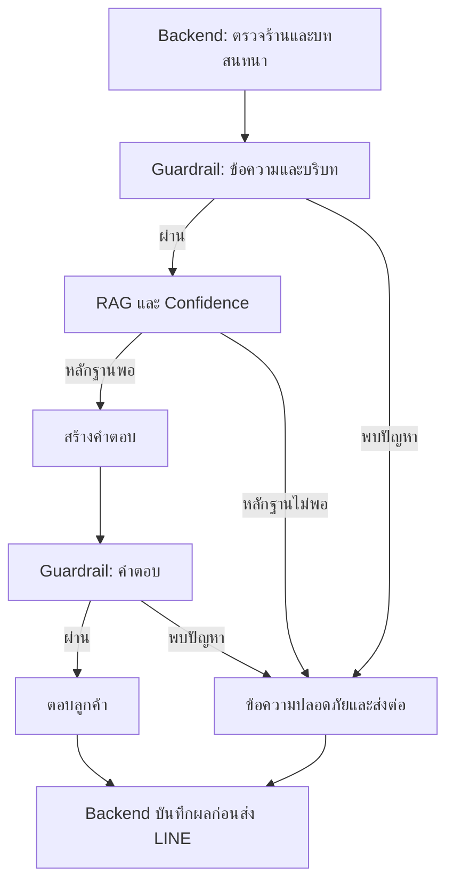

# คู่มืองานของคิว: MCP + Confidence + Guardrail

งานนี้พัฒนาต่อจาก `feature/ai-integration` ของ [Chatto-AI-Commerce-Assistant](https://github.com/namnueatechtitan/Chatto-AI-Commerce-Assistant/tree/feature/ai-integration)
ที่ commit `8759b6f543aaf9432385364cbd5787a47c857f5e` วันที่ 5 กันยายน 2026
ใช้ branch ทำงาน `feature/mcp-confidence-guardrail` อยู่ในขอบเขต Phase 2

โค้ดที่ส่งมอบ build และทดสอบในเครื่องทดสอบแล้ว ยังไม่ได้ push เข้า GitHub เพราะบัญชีที่เชื่อมอยู่มีสิทธิ์อ่านอย่างเดียว
ชุด ZIP เป็นชุดการเปลี่ยนแปลงสำหรับนำเข้า repo เดิม ไม่ใช่โปรเจกต์เต็ม

## 1. งานของคิวทำอะไร

| ส่วน | หน้าที่ | สิ่งที่เพิ่มจากเดิม |
| --- | --- | --- |
| MCP | ช่องทางมาตรฐานให้ระบบเรียกเครื่องมือ AI | ใช้ official SDK + Streamable HTTP; มี schema, authentication และตรวจขอบเขตร้าน |
| Confidence | ประเมินว่ามีหลักฐานพอจะตอบหรือไม่ | แยกคะแนนเจตนาออกจากหลักฐาน; มี threshold และเหตุผลส่งต่อ |
| Guardrail | ตรวจสิ่งที่เข้ามาและสิ่งที่จะตอบออกไป | ตรวจ input, context/history และ output; ตรวจรูปแบบ injection, credential, action claim และตัวเลขที่ไม่มีในหลักฐาน |
| Backend integration | ทำให้ผลตัดสินมีผลในระบบจริง | บันทึก audit, guardrail events, สร้างหรือใช้ ticket เดิม และเปลี่ยนสถานะ conversation |

โค้ดเดิมมี MCP routes และ RAG อยู่แล้ว แต่ Guardrail เป็น `allowed: true` ทุกครั้ง และใช้ confidence ของ intent เป็น confidence ของคำตอบ
อีกจุดที่แก้คือ `needs_handover` เคยถูกยกเลิกเมื่อ Gemini ตอบสำเร็จ ตอนนี้การตอบสำเร็จของ provider ไม่สามารถลบผลตัดสินด้านความปลอดภัยได้

## 2. Flow ใหม่



- คำทักทายใช้ข้อความตายตัวที่ปลอดภัย ไม่เรียก LLM หรือ embedding
- ถ้าขอคุยกับเจ้าหน้าที่ ให้ส่งต่อแม้คะแนนเจตนาจะสูง
- ข้อมูลต้องอยู่ในร้านเดียวกันทั้งหมด ตรวจตั้งแต่ก่อน embedding และ vector sync
- ข้อมูลที่ค้นได้แต่ไม่มี lexical/semantic evidence พอจะไม่ถูกส่งเข้า LLM
- ไม่คืน `debug` ที่เคยมี system prompt, ข้อมูลบริบท และคำตอบดิบของ provider
- ถ้า AI Service timeout, ติดต่อไม่ได้ หรือคืน response ผิด contract, backend สร้างคำตอบสำรองและขอ handover

## 3. ไฟล์ที่สร้างใหม่

ทุก path ในตารางเริ่มจาก root ของ repo

| ไฟล์ใหม่ | หน้าที่ |
| --- | --- |
| `apps/ai-service/src/app.ts` | สร้าง Express app; token, Origin check, validation และ routes |
| `apps/ai-service/src/modules/chat-pipeline.ts` | ประสาน MCP tools, RAG, confidence, LLM และ output guardrail |
| `apps/ai-service/src/modules/confidence/index.ts` | คำนวณคะแนนและตัดสิน answer/handover |
| `apps/ai-service/src/modules/mcp/schemas.ts` | Zod schema ของ request/context/tools และตรวจ merchant scope |
| `apps/ai-service/src/modules/mcp/tools.ts` | รายการเครื่องมือและ dispatcher เดียวสำหรับ pipeline กับ MCP |
| `apps/ai-service/src/modules/mcp/server.ts` | MCP server จาก SDK; initialize, tools และ resources ผ่าน Streamable HTTP |
| `apps/ai-service/src/modules/mcp/resources.ts` | Policy resources และอ่านข้อมูลร้านผ่าน internal API |
| `apps/ai-service/src/modules/mcp/context.ts` | ย้ายตัวสร้าง vector documents ออกจาก `index.ts` |
| `apps/ai-service/scripts/safety.test.cjs` | Unit/HTTP tests และเชื่อมด้วย official MCP client |
| `apps/ai-service/scripts/demo-safety.ps1` | ทดลอง AI Service 5 กรณีจาก PowerShell |
| `apps/api/src/modules/ai-integration/ai-safety.service.ts` | บันทึก audit/guardrail/ticket และเปลี่ยน conversation ใน transaction |
| `apps/api/src/modules/ai-integration/ai-response.validator.ts` | ตรวจ response ก่อนใช้หรือส่งลูกค้า |
| `apps/api/scripts/ai-safety.test.cjs` | ทดสอบ validator, audit, handover และ integration ด้วย dependency mocks |
| `docs/implementation/mcp-confidence-guardrail-th.md` | คู่มือนี้ |

## 4. ไฟล์เดิมที่แก้

| ไฟล์เดิม | สิ่งที่แก้ |
| --- | --- |
| `apps/ai-service/src/index.ts` | เหลือโหลด env และเริ่ม server; ย้าย flow/routes ไปโมดูลแยก |
| `apps/ai-service/src/modules/guardrails/index.ts` | แทน placeholder ด้วย input/context/output rules และข้อความสำรอง |
| `apps/ai-service/src/modules/prompt-manager/index.ts` | กำหนดให้ context/history เป็นข้อมูลที่เชื่อถือคำสั่งไม่ได้ และห้ามเปิดเผยข้อมูลลับ |
| `apps/ai-service/src/modules/evaluation/index.ts` | ตรวจข้อความว่างและขอบเขตคะแนนจริง แทน passed=true ทุกครั้ง |
| `apps/ai-service/src/modules/rag/index.ts` | เพิ่มคำอธิบายว่าข้อมูลที่ retrieve ได้ยังเป็น candidate ต้องผ่าน confidence |
| `apps/ai-service/src/types/ai-contract.types.ts` | เพิ่ม confidence details, guardrails, handover reason และ tool names |
| `apps/api/src/modules/ai-integration/ai-contract.types.ts` | เพิ่ม response fields และ merchant threshold ให้ตรง AI Service |
| `apps/api/src/modules/ai-integration/ai-integration.service.ts` | เช็ก conversation, validate response, บันทึกผลก่อนคืนคำตอบ และ fallback เมื่อ AI Service ล่ม |
| `apps/api/src/modules/ai-integration/ai-integration.module.ts` | ลงทะเบียน AiSafetyService |
| `apps/api/src/modules/internal-ai/internal-ai.service.ts` | ส่งค่า AiSetting.handoverThreshold ไป AI |
| `apps/api/src/modules/line-webhooks/line-webhooks.service.ts` | เพิ่มรายละเอียด confidence/guardrails/handover ใน message metadata |
| `apps/ai-service/package.json` | เพิ่ม SDK 1.30.0, Zod 4.5.4 และ test command |
| `apps/api/package.json` | เพิ่ม test command |
| `pnpm-lock.yaml` | ล็อก dependencies ของการเปลี่ยนแปลง |
| `.env.example` | เพิ่ม default threshold และรายการ Origin ที่อนุญาต |
| `docker-compose.yml` | ส่ง env ใหม่เข้า AI Service |
| `README.md` | เพิ่มทางเข้าคู่มือและคำสั่งทดสอบ |
| `docs/architecture/mcp-phase-2.md` | อัปเดต MCP protocol/flow และข้อจำกัด |
| `docs/architecture/repo-structure.md` | อัปเดตโมดูลใหม่ |
| `docs/api-contract/phase-2-draft.md` | อัปเดตเส้นทางและ response contract |
| `apps/api/src/modules/ai-integration/README.md` | อธิบาย backend safety integration |

ไม่มีการเพิ่มตารางหรือ migration ใช้ `AiSetting`, `AiActionLog`, `GuardrailEvent`, `HandoverTicket`, `Conversation` เดิม
ไม่มีการเพิ่มระบบทำรายการสั่งซื้อ ชำระเงิน หรือตัดสต็อก

## 5. Confidence คิดอย่างไร

ให้ I = คะแนนจาก intent classifier, E = คะแนนหลักฐานสูงสุดของ chunks ที่ผ่านการคัดแล้ว

`E = max(semantic_score, lexical_score)` และ `confidence = 0.2 × I + 0.8 × E`

ไม่เอาคะแนนความตรงกันของประเภทเอกสาร (`intent_score`) มาทำให้ confidence สูง เพราะเอกสารหมวดสินค้าอาจไม่ใช่สินค้าที่ลูกค้าถาม
คำทักทายและคำขอเปลี่ยนภาษาใช้ I โดยไม่ต้องมีหลักฐานร้าน

- default threshold = 0.65; ค่าใน `AiSetting.handoverThreshold` มาก่อน env `AI_HANDOVER_THRESHOLD`
- คะแนนเท่ากับ threshold ผ่านได้ แต่ต้องไม่ติด hard gate
- ไม่มีหลักฐาน, หลักฐานอ่อน, intent ไม่ชัด, guardrail block หรือขอคุยกับคน → handover
- คะแนนสูง = ตั้งแต่ 0.80; ปานกลาง = ตั้งแต่ threshold แต่ต่ำกว่า 0.80; ต่ำ = ต่ำกว่า threshold
- คะแนนนี้เป็น heuristic สำหรับ routing ไม่ใช่เปอร์เซ็นต์ความถูกต้องที่ผ่านการ calibration

ตัวอย่าง I=0.82 และ E=0.90 ได้ 0.884 จึงผ่าน default threshold
ถ้าเจอแค่เอกสารหมวดสินค้าแต่ lexical/semantic เป็น 0 จะตอบไม่ได้แม้ intent สูง

## 6. API/MCP ที่ใช้งานได้

AI Service ใช้ port **5000**, Backend ใช้ port **4000**

| Endpoint | การใช้งาน |
| --- | --- |
| `GET /health` | ตรวจสุขภาพ ไม่ต้องมี token |
| `POST /mcp` | MCP protocol มาตรฐานแบบ stateless Streamable HTTP |
| `POST /mcp/chat` | REST chat orchestration ภายในสำหรับ backend ไม่ใช่ MCP tools/call wire format |
| `POST /ai/chat` | compatibility alias ใช้ flow เดียวกัน |
| `POST /mock-reply` | alias ที่เลิกใช้แล้ว ต้องส่ง AiChatRequest เต็มและ token; ไม่รับ body แบบเก่า `{message}` |
| `GET /mcp/manifest`, `GET /mcp/tools` | ดู manifest/tool schemas |
| `GET /mcp/resources` | ดู resources และ templates |
| `POST /mcp/resources/read` | อ่าน resource; context ที่ส่งมาใน body ต้องผ่าน schema/scope |
| `POST /mcp/tools/:toolName/call` | REST helper โดยส่ง `{ "input": { ... } }` |

ทุก operational endpoint ต้องใช้ `Authorization: Bearer <AI_SERVICE_TOKEN>`
`X-Merchant-Id` จำเป็นสำหรับ merchant resource และเครื่องมือ build_context/retrieve_knowledge
เมื่อส่ง header นี้เข้า chat ต้องตรงกับ merchant_id ใน body

MCP tools/call ใช้ `params.arguments` ตามมาตรฐาน เช่น:

```json
{
  "jsonrpc": "2.0",
  "id": 2,
  "method": "tools/call",
  "params": {
    "name": "chatto.evaluate_guardrails",
    "arguments": { "message": "ขอคุยกับเจ้าหน้าที่" }
  }
}
```

MCP client ต้อง initialize ก่อนตามปกติ และส่ง Accept รองรับ `application/json, text/event-stream`
SDK จัดการ protocol version, notifications และ JSON-RPC errors
มี policy resources จริง 2 รายการ และ merchant resource templates 3 รายการ: profile, knowledge-base, vector-documents
Memory ยังเป็น scaffold; conversation history ถูกส่งผ่าน chat context ไม่ได้ประกาศเป็น live MCP resource

ระบบนี้ใช้ shared service token สำหรับ backend ที่เชื่อถือได้ ไม่ใช่ OAuth/RBAC สำหรับผู้ใช้ปลายทาง
อย่านำ service token ไปใส่ใน frontend; การตรวจ merchant header เป็นการตรวจความสอดคล้องภายใต้ขอบเขตความเชื่อถือของ backend
Origin allowlist ใช้ตรวจ Origin header ของ client ไม่ได้เปิด CORS สำหรับเรียกจาก browser frontend โดยตรง

## 7. วิธีใส่โค้ดในเครื่องคิว

1. แตก ZIP ไว้นอกโฟลเดอร์ repo เช่น `C:\Users\User\Downloads\chatto-mcp`
2. เปิด PowerShell ใน repo ที่คิวใช้อยู่:

```powershell
cd C:\Users\User\Chatto-AI-Commerce-Assistant-1
git status --short
git branch --show-current
```

ถ้ามีงานค้าง ให้บันทึกงานเดิมให้เรียบร้อยก่อน อย่านำ patch ทับงานค้างโดยไม่ตรวจ
ถ้ามี branch ของคิวแล้ว ให้ใช้:

```powershell
git switch feature/mcp-confidence-guardrail
```

ถ้ายังไม่มี branch:

```powershell
git fetch origin
git switch -c feature/mcp-confidence-guardrail origin/feature/ai-integration
```

3. ตรวจ patch ก่อน แล้วจึง apply; รันคำสั่งถัดไปเมื่อคำสั่งก่อนหน้าสำเร็จเท่านั้น:

```powershell
git apply --check C:\Users\User\Downloads\chatto-mcp\mcp-confidence-guardrail.patch
git apply C:\Users\User\Downloads\chatto-mcp\mcp-confidence-guardrail.patch
git diff --stat
```

อีกทางหนึ่งเรียก `APPLY-ON-WINDOWS.ps1` จาก ZIP ขณะอยู่ใน repo; helper ตรวจ branch, งานค้าง และ patch ก่อน apply
ไฟล์ใน `changed-files/` ใช้เปิดเทียบกับ repo ตาม path ได้ ไม่จำเป็นต้องคัดลอกทับเมื่อ apply patch แล้ว

ถ้า `git apply --check` ไม่ผ่าน ให้หยุดก่อน เพราะฐานหรือไฟล์คิวอาจต่างจากชุดนี้
สามารถสร้าง branch แยกจาก commit ฐานที่ระบุข้างต้นเพื่อตรวจชุดแก้ไข โดยไม่ย้อนทับ branch ที่มีงานของคิว

4. ติดตั้งและทดสอบ ใช้ Node.js 20+ และ pnpm 9.12.0 ตามโปรเจกต์:

```powershell
corepack pnpm install --frozen-lockfile
corepack pnpm --filter @chatto/api prisma:generate
corepack pnpm --filter @chatto/ai-service test
corepack pnpm --filter @chatto/api test
```

ไม่ต้องใส่ Gemini key เพื่อรัน automated tests
ถ้าใช้ `pnpm` 9.12.0 อยู่แล้ว ตัดคำว่า `corepack` ออกได้
`.env` เดิมของคิวเก็บไว้ เติมเฉพาะค่าที่ต้องใช้:

```env
AI_HANDOVER_THRESHOLD=0.65
AI_SERVICE_ALLOWED_ORIGINS=
```

เมื่อ merchant มีค่า handoverThreshold อยู่ใน DB ค่านั้นมีลำดับสูงกว่า env

5. ทดลอง AI Service แยกก่อน:

```powershell
$env:AI_LLM_PROVIDER = "mock"
$env:GEMINI_API_KEY = ""
corepack pnpm --filter @chatto/ai-service dev
```

เปิด PowerShell อีกหน้าที่ root ของ repo:

```powershell
.\apps\ai-service\scripts\demo-safety.ps1
```

ถ้า AI_SERVICE_TOKEN ใน `.env` เปลี่ยนจากค่าเริ่มต้น ให้ส่ง `-Token` ด้วยค่าที่ตั้งไว้
สคริปต์นี้ยิงตรง AI Service จึงตรวจคำตอบและ handover flag เท่านั้น ไม่สร้าง ticket ใน DB

6. ทดลองระบบรวมจาก Docker:

```powershell
docker compose up -d --build
docker compose ps
docker compose logs --tail=100 api ai-service
```

รอ `db-init` เสร็จและ services healthy แล้วทดสอบกับ LINE OA ของทีม
หลังขอคุยกับเจ้าหน้าที่ ควรพบ ticket และ conversation เป็น `HANDOVER_REQUESTED`; ข้อความถัดไปยังบันทึกเข้า conversation แต่ AI จะไม่ตอบแทรก
ต้องมี workflow เจ้าหน้าที่รับ/ปิดงานและคืนสถานะ `AI_ACTIVE` ตามที่ทีม backend กำหนด ไม่ควรเปลี่ยนกลับอัตโนมัติทุกข้อความ

7. เมื่อคิวตรวจ diff แล้ว สามารถ commit เฉพาะไฟล์ตามรายการในคู่มือนี้ได้
การ push ยังต้องมีสิทธิ์ collaborator/write ใน repo นี้ ติดต่อเจ้าของ repo ให้เพิ่มสิทธิ์บัญชีคิวก่อน
เมื่อมีสิทธิ์และ commit แล้ว:

```powershell
git push -u origin feature/mcp-confidence-guardrail
```

## 8. สิ่งที่ทดสอบแล้วและสิ่งที่ทีมต้องลองต่อ

ผลตรวจบนชุดส่งมอบ: **43 tests ผ่าน** — AI Service 31, Backend 12; TypeScript build ผ่านทั้งสองบริการ
ทดสอบด้วย Node.js 24.19.0 และ pnpm 9.12.0 ในเครื่องทดสอบ

ครอบคลุม token, malformed request, merchant mismatch, tool validation, threshold boundary, input/history/document injection, unsupported output numbers/actions, provider fallback, no-evidence gate, ticket reuse, request deduplication และ human takeover
MCP ทดสอบด้วย official Client ผ่าน HTTP จริงในเครื่องทดสอบ
Backend ใช้ Prisma/dependency mocks จึงยังไม่ใช่หลักฐานว่ารันกับ PostgreSQL และ LINE OA จริงแล้ว

| กรณีที่ทีมควรลองในระบบจริง | ผลที่คาดหวัง |
| --- | --- |
| ทักทาย | ตอบปกติ ไม่มี handover |
| ถามสินค้าที่มีหลักฐานตรง | ตอบพร้อม source และ confidence details |
| ถามสิ่งที่ไม่มีข้อมูล | handover; ไม่แต่งคำตอบ |
| ขอคุยเจ้าหน้าที่ | สร้าง/ใช้ ticket เดิม และหยุด AI ใน conversation |
| คำสั่งให้เปิดเผย prompt หรือ key | safe reply + guardrail event + handover |
| AI Service ปิดหรือ timeout | backend fallback + handover ถ้า DB พร้อมใช้งาน |
| ส่ง webhook ซ้ำ/คำขอซ้ำ | ไม่สร้าง audit/ticket/คำตอบซ้ำสำหรับ request เดิม |

สิ่งที่ยังไม่ได้ทดสอบจริงในสภาพแวดล้อมนี้: Docker build, PostgreSQL transaction/lock, การส่ง LINE, Gemini API และการรับงานผ่านหน้า inbox ของทีม
ไม่เพิ่ม frontend ใหม่ในงานนี้; handover inbox และ CRUD endpoints เดิมบางส่วนยังเป็น scaffold ต้องเชื่อมกับ ticket workflow ของทีมต่อ

## 9. ข้อจำกัดที่ควรอธิบายอาจารย์ตรง ๆ

Guardrail เป็น rule-based defense หลายจุด ยังมีทั้งกรณีตรวจเกินและกรณีหลุด ไม่รับประกันป้องกัน prompt injection ทุกแบบ
การตรวจตัวเลขดูว่ามีตัวเลขในหลักฐาน ไม่ได้พิสูจน์ว่าจับคู่ราคากับสินค้าถูกทุกกรณี และไม่ตรวจความหมายของข้อความทุกประโยค
Confidence เป็นหลักเกณฑ์ routing เริ่มต้น ต้องใช้ชุดคำถามจริงภาษาไทย/อังกฤษของร้านมาปรับ threshold และวัดผลภายหลัง
ถ้าไม่มี Gemini embedding และคำถามคนละภาษากับเอกสาร lexical evidence อาจต่ำและส่งต่อบ่อย ซึ่งเป็นพฤติกรรมที่ตั้งใจให้เลือกความปลอดภัย

API บันทึกการตัดสินก่อนส่ง LINE จึงมีลักษณะ at-most-once ต่อ request; งานนี้ยังไม่ได้เพิ่ม outbox/retry สำหรับกรณี process ล่มระหว่างบันทึกกับส่งหรือ LINE ส่งไม่สำเร็จ
การล็อกแถวช่วยป้องกัน ticket ซ้ำและ suppress คำตอบเมื่อพบ human takeover ใน transaction แต่ไม่ได้จัดคิว webhook หลายข้อความให้ตอบตามลำดับทุกกรณี
ถ้า DB ไม่พร้อมใช้งาน ระบบจะหยุดก่อนส่ง AI reply ไม่สามารถอ้างว่าสร้าง ticket สำเร็จได้

## 10. คำอธิบายสั้น ๆ สำหรับคิวนำเสนอ

“ส่วนที่ผมทำคือเพิ่มชั้นควบคุมก่อนที่ AI จะตอบลูกค้าครับ MCP ทำให้การเรียกเครื่องมือมีรูปแบบและตรวจข้อมูลได้ ส่วน Confidence ประเมินจากหลักฐานที่ค้นเจอ ไม่ใช้แค่ความมั่นใจในการเดาเจตนา แล้ว Guardrail ตรวจทั้งข้อความเข้า บริบท และคำตอบ ถ้าข้อมูลไม่พอหรือพบความเสี่ยง ระบบจะใช้ข้อความปลอดภัยและให้ backend บันทึกเหตุผลพร้อมส่งต่อเจ้าหน้าที่ครับ ตอนนี้ผ่านการทดสอบอัตโนมัติแล้ว ส่วนถัดไปคือทดสอบกับฐานข้อมูลและ LINE ของทีมจริง”

แหล่งอ้างอิง implementation MCP: [MCP TypeScript SDK v1.x](https://github.com/modelcontextprotocol/typescript-sdk/tree/v1.x), [SDK server examples](https://github.com/modelcontextprotocol/typescript-sdk/blob/v1.x/docs/server.md)
